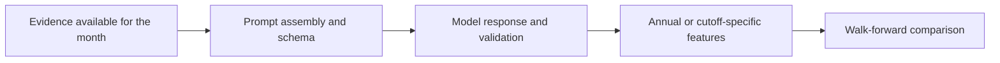

# Monthly signal pipeline

The monthly study assembles Wikipedia evidence, renders a prompt under a scoring contract, records model responses and aggregates the resulting monthly measurements for evaluation against an annual target.

Inspect [generation and prompt assembly](https://github.com/skyboyrahul/political-risk-llm-nowcasting/blob/main/pipeline/generate.py), [ingestion](https://github.com/skyboyrahul/political-risk-llm-nowcasting/blob/main/pipeline/ingest.py) and [nowcast evaluation](https://github.com/skyboyrahul/political-risk-llm-nowcasting/blob/main/analysis/ml_experiments/nowcast_walk_forward.py). The public prompt example uses explanatory placeholders where the research workflow requires licensed descriptions or anchors. It is not the exact historical rendered prompt.

No fresh LLM generation is needed for the public synthetic example. The original monthly model-response archive is excluded, including any responses that contain licensed anchors or observations.

The supplied-input adapter uses the retained full-year coverage rule to qualify
the evaluation panel. Cutoff feature values stop at the stated month, but panel
eligibility can depend on later-month availability. See the [timing
qualification](strict-lag.md) before interpreting this as an operational live
nowcasting process.

The retained study panel used the original Portal-first evidence regime, with Year-in-Country material filling missing cells. A later union of both sources would change the input regime. Public source inspection cannot establish that every historical measurement used a particular retained page revision; see [Wikipedia provenance](wikipedia.md).
