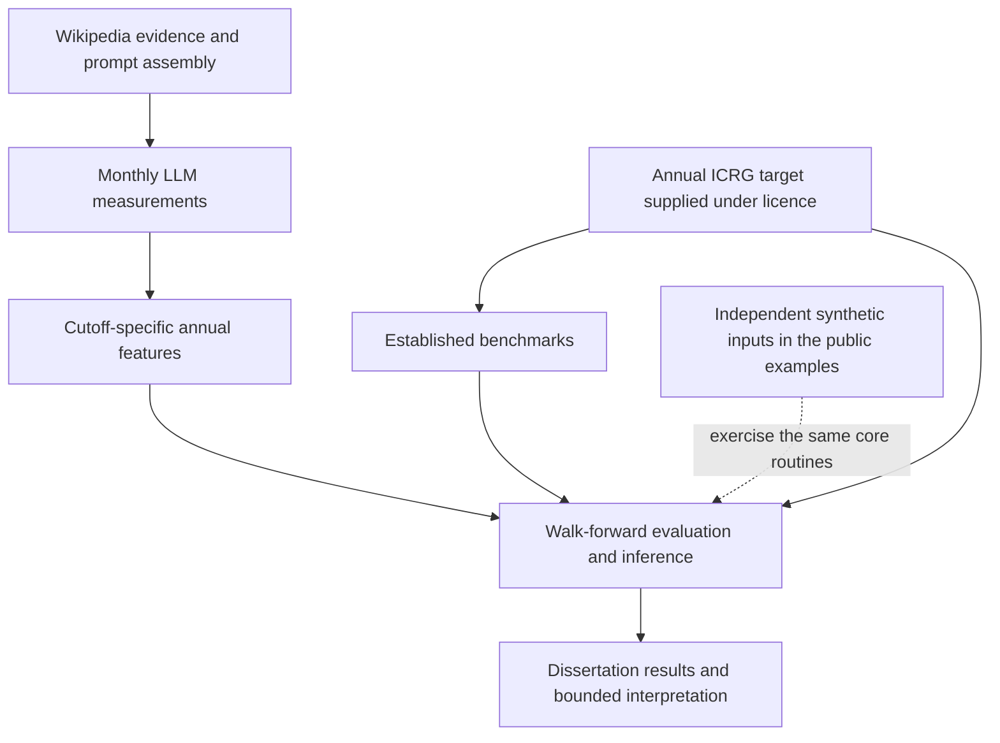

# Research and repository map

The study asks whether monthly LLM readings of Wikipedia add information for estimating annual political-risk ratings during the same year. The central computational distinction is between the information available to an estimator and the period its target measures.

## From inputs to interpretation

This diagram describes the research design. The public examples supply synthetic inputs; the historical empirical inputs are excluded.

## Where each part lives

| Public repository | Role | Reading route |
|---|---|---|
| [LLM nowcasting](https://github.com/skyboyrahul/political-risk-llm-nowcasting) | Pipeline, aggregation, pooled estimators and uncertainty calculations | [Monthly pipeline](reference/monthly-pipeline.md) |
| [Established baselines](https://github.com/skyboyrahul/political-risk-established-baselines) | Data preparation, benchmark estimators and forecast timing | [Established methods](reference/established.md) |
| [Dissertation guide](https://github.com/skyboyrahul/political-risk-dissertation-guide) | Chapter routes, evidence qualifications and supplementary source | [Methods-to-results map](reference/central-map.md) |

Supplementary analyses address wealth-stratified errors, rater disagreement and model-origin contrasts. Their source is collected in this guide repository. Their empirical inputs and retained outputs are outside the public release.

Chapters 1 and 2 establish the problem and literature. Chapter 3 defines the data and methods, Chapter 4 reports the results, and Chapter 5 interprets the findings. Use the dissertation itself for the reported numerical findings and the [public source register](source-revisions.md) for release provenance.
