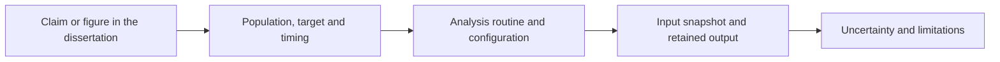

# Follow a dissertation result

Use the dissertation for the empirical estimates and this guide to locate the method that produced them. The public release deliberately does not include the underlying country-year observations or the original target-bearing output records.

## A result has several parts

The [claim-to-method map](reference/claims.md) identifies the public analysis routes. The input snapshot and retained output step requires authorised access to the private evidence archive.

For each comparison, check the model, feature timing, countries, years, target definition, averaging convention and inference method. A matching method name or a nearby numerical estimate is insufficient to establish that two results are the same experiment.

Read [result authority](reference/authority.md) before combining frozen and revised outputs. The [ARIMAX limitation](reference/arimax.md) remains unresolved at the originally reported precision. The public release does not repair that discrepancy by substituting another estimate.

Synthetic demonstration metrics are labelled synthetic. They provide execution evidence only and should not be quoted as dissertation findings.
